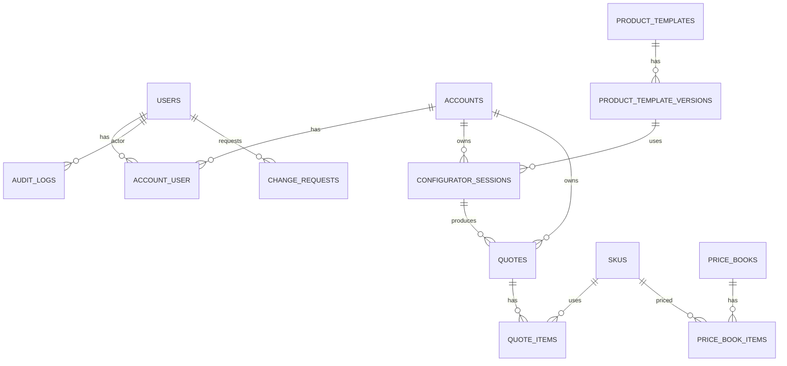
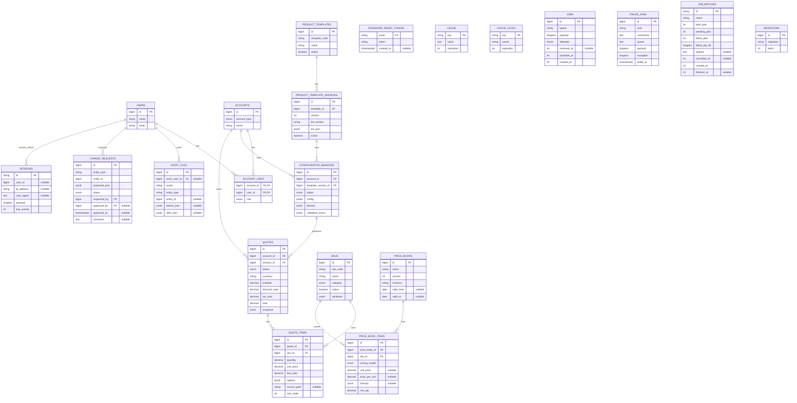

 public | account_user              | table | mfd
 public | accounts                  | table | mfd
 public | audit_logs                | table | mfd
 public | cache                     | table | mfd
 public | cache_locks               | table | mfd
 public | change_requests           | table | mfd
 public | configurator_sessions     | table | mfd
 public | failed_jobs               | table | mfd
 public | job_batches               | table | mfd
 public | jobs                      | table | mfd
 public | migrations                | table | mfd
 public | password_reset_tokens     | table | mfd
 public | price_book_items          | table | mfd
 public | price_books               | table | mfd
 public | product_template_versions | table | mfd
 public | product_templates         | table | mfd
 public | quote_items               | table | mfd
 public | quotes                    | table | mfd
 public | sessions                  | table | mfd
 public | skus                      | table | mfd
 public | users                     | table | mfd


今あるこれらのテーブルの役割と、ほかの似たテーブルとの役割の違いを教えて


以下に「各テーブルの役割」と「似たテーブルとの違い」を簡潔にまとめます。

---

**account_user**  
- 役割: `accounts` と `users` の中間（多対多）＋ `role` を保持  
- 違い: `users` は個人、`accounts` は法人/顧客単位。`account_user` が所属と権限を表す

**accounts**  
- 役割: 顧客アカウント（B2B/B2C など）  
- 違い: `users` がログイン主体、`accounts` は取引主体

**audit_logs**  
- 役割: 操作履歴（誰が何をどう変更したか）  
- 違い: `change_requests` は申請/承認フロー、`audit_logs` は確定した実行ログ

**cache / cache_locks**  
- 役割: アプリ内部の一時キャッシュ / ロック  
- 違い: 業務データではない。`cache_locks` は排他用

**change_requests**  
- 役割: 編集の承認リクエスト（提案データ + 状態）  
- 違い: `audit_logs` は実行後の記録、`change_requests` は実行前の申請

**configurator_sessions**  
- 役割: コンフィギュレータの編集中データ（入力・導出・検証）  
- 違い: `quotes` は発行済み見積（固定スナップショット）

**failed_jobs / jobs / job_batches**  
- 役割: キュー処理の実行管理（失敗・実行中・バッチ）  
- 違い: どれも業務データではなく非同期処理用

**migrations**  
- 役割: マイグレーションの適用履歴  
- 違い: スキーマ管理専用

**password_reset_tokens**  
- 役割: パスワード再設定トークン  
- 違い: 認証系の一時テーブル

**price_books / price_book_items**  
- 役割: 価格表本体 / 価格表の明細（SKUごとの価格ルール）  
- 違い: `price_books` はヘッダ、`price_book_items` は明細

**product_templates / product_template_versions**  
- 役割: テンプレ本体 / そのバージョン（DSL含む）  
- 違い: `product_templates` は安定ID、`product_template_versions` が実際のDSLの版

**quote_items / quotes**  
- 役割: 見積ヘッダ / 見積明細  
- 違い: `quotes` が全体金額とスナップ、`quote_items` が行ごとの内訳

**sessions**  
- 役割: Laravel のログインセッション保存  
- 違い: `configurator_sessions` とは無関係（名前が似ているだけ）

**skus**  
- 役割: 販売単位（部品・工程・コネクタなど）  
- 違い: `quote_items` は価格付きの実績明細、`skus` はマスタ

**users**  
- 役割: ログインユーザー  
- 違い: `accounts` は顧客単位、`users` は人・担当者

---

必要なら、ER図的に「どことどこがFKでつながるか」まで整理します。


以下は **FK（外部キー）接続のER図的整理**です。  
「親 → 子」の向きで書いています。

---

**accounts**
- accounts.id → account_user.account_id
- accounts.id → configurator_sessions.account_id
- accounts.id → quotes.account_id

**users**
- users.id → account_user.user_id
- users.id → audit_logs.actor_user_id
- users.id → change_requests.requested_by
- users.id → change_requests.approved_by

**account_user**
- account_user.account_id → accounts.id  
- account_user.user_id → users.id  
（複合PK: `account_id + user_id`）

---

**product_templates**
- product_templates.id → product_template_versions.template_id

**product_template_versions**
- product_template_versions.id → configurator_sessions.template_version_id

---

**configurator_sessions**
- configurator_sessions.id → quotes.session_id

---

**quotes**
- quotes.id → quote_items.quote_id

**skus**
- skus.id → price_book_items.sku_id
- skus.id → quote_items.sku_id

**price_books**
- price_books.id → price_book_items.price_book_id

---

**audit_logs**
- audit_logs.actor_user_id → users.id  
（`actor_user_id` は nullable）

**change_requests**
- change_requests.requested_by → users.id  
- change_requests.approved_by → users.id（nullable）

---

### FKが無い主なテーブル（システム系）
- sessions / password_reset_tokens / cache / cache_locks / jobs / failed_jobs / job_batches / migrations

---

必要なら **ER図のASCII/図式（Mermaid）** でも出せます。


以下に **ASCII と Mermaid** 両方で ER 図を出します。

**ASCII**
```
users (id)
  |< account_user (user_id, account_id, role) >| 
accounts (id)
  |< configurator_sessions (account_id, template_version_id)
  |< quotes (account_id, session_id)

product_templates (id)
  |< product_template_versions (template_id)

product_template_versions (id)
  |< configurator_sessions (template_version_id)

configurator_sessions (id)
  |< quotes (session_id)

quotes (id)
  |< quote_items (quote_id, sku_id)

skus (id)
  |< price_book_items (sku_id)
  |< quote_items (sku_id)

price_books (id)
  |< price_book_items (price_book_id)

audit_logs (actor_user_id) -> users (id)
change_requests (requested_by, approved_by) -> users (id)
```

**Mermaid**


必要なら「nullable かどうか」や「複合PK」も Mermaid に入れます。


以下は **sessions / password_reset_tokens / cache / jobs** などの補助テーブルも含めた **完全版 Mermaid ER図** です。  
（FKが無い補助テーブルは「独立」として明記）



**補助テーブルの扱い**
- `sessions` は `users.id` と関連（FKは明示されていないが論理的に紐付く）
- `password_reset_tokens / cache / jobs / migrations` などは **業務テーブルと独立**

必要なら「FKを厳密に貼っている/貼っていない」を図中で色分けする版も作成できます。