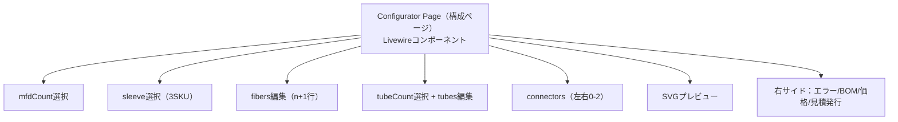
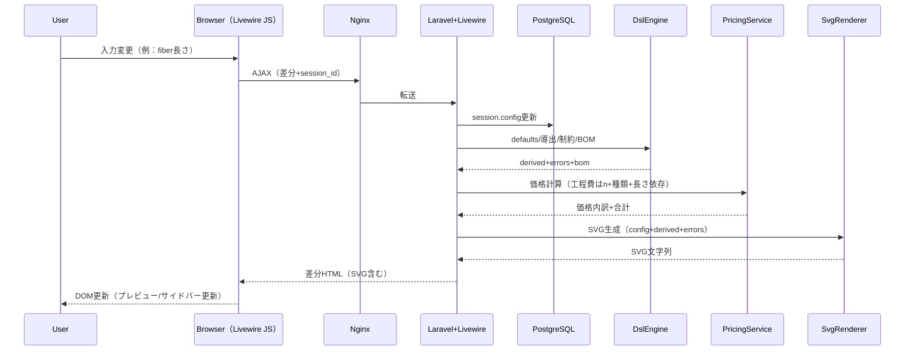

あんまよくわかってないんだけど、「SPAにせずNodeビルド等を避けて開発負荷を下げる」という手法でありながら、「Laravel + Livewire（AJAXで部分更新） + Blade + Tailwind」の実装方式であれば、「ページ遷移を減らしつつフルSPAにしない、Next.jsを用いたSSRアプリケーション」が作れるんですか？
であればこの第一候補：Laravel（PHP枠組み） + Livewire（サーバ主導のリアクティブUI） + Blade（テンプレート） + Tailwind（CSS枠組み）を採用します。


あと、ワンチャンこの、「2) 画面（UI）をどう分解するか（コンポーネント設計）」のUI設計をdiagrams.netとか使って図示できたりできませんか？


また、必要なので先方に提出する体裁（1枚の設計メモ）**に整えて、
画面ワイヤーフレーム（文章ベースのレイアウト図）
画面遷移（フロー）
入力項目一覧（mfdCount/fibers/tubes/connectors）
更新タイミング（いつサーバ評価するか）
までを“提出用”に再構成してください。


なお、先方が一番気にしているのは2D表示（SVG）の部分なので、ここの詳細イメージをお願いします。それ以外はそのまま採用します。特にこの一文「実装は、最初は サーバでSVG文字列を生成してBladeに埋め込むのが簡単です（JS少なめ）。」の仕組み・システムアーキテクチャ的な部分の表現をより細かくお願いします

MVPでは3Dなし。構成のプレビューは SVGで“直列構成”を模式図表示。
左右端：コネクタ（選択時のみ表示）
中央：fiber区間（n+1本）を連結表示、tube装着は対象区間targetFiberIndexにオーバーレイ
mfdCountに応じて「変換点」をマーカー表示
各区間に長さラベル表示（mm）


整理します。あなたの理解（「SPA（単一ページアプリ）にせず、Node（JavaScript実行環境）ビルド等を避けて開発負荷を下げたい」）と、こちらの提案（Laravel（PHPの開発枠組み）+ Livewire（サーバ主導で画面を部分更新する仕組み）+ Blade（HTMLテンプレート）+ Tailwind（CSS枠組み））は **両立します**。ただし、呼び方だけ注意点があります。

---

# 1) 「Next.jsのSSRアプリ」が作れるのか？への正確な答え

結論：

* **Next.js（React系フロント枠組み）“そのもの”のSSR（サーバでHTML生成して返す方式）アプリ**は、Next.jsを使わないので作れません（当たり前ですが）。
* ただし **「SSRっぽい体験（初期表示はサーバ生成HTML）＋ページ遷移を減らす（同一ページ内で部分更新）」**は **Livewireで実現できます**。
  なので先方には「Next.jsのSSRに近い“体験”を、Laravel＋Livewireで実現する方針」と説明するのが正確です。

## 1-1. Next.jsのSSR（概念）の中身

Next.js（React系）だと大枠はこうです：

* 初回：サーバ（Node）でHTML生成 → ブラウザに返す（SSR）
* その後：Reactが「Hydration（HTMLにJSを結びつけて動かす処理）」 → 画面操作はクライアント（ブラウザ側）主体
* ルーティング（画面遷移）はクライアント側で高速（SPA寄り）

## 1-2. Laravel + Livewire の中身（“SSRっぽい”理由）

Laravel + Blade は元々「サーバがHTMLを生成して返す」方式です（=広い意味ではSSR）。

そこに Livewire を足すと：

* 初回：BladeがHTML生成 → ブラウザに返す（サーバ生成HTML）
* 操作時：Livewireが **AJAX（裏でHTTP通信して一部だけ更新する仕組み）**でサーバへ「変更内容」を送る
* サーバ側：そのコンポーネント（画面部品）を再レンダリング（再度HTMLを作る）
* ブラウザ側：返ってきた差分HTMLでDOM（画面要素）を差し替える
  → **“フルSPAではないが、同じページ内は遷移せずサクサク更新できる”**

つまり **Next.js＝ブラウザでJSが主役になりがち**、**Livewire＝サーバでHTML生成が主役**、という違いです。

## 1-3. 「Nodeビルドを避ける」の解釈だけ注意

* Next.jsは **Nodeが主役（ビルドも実行も）**なので運用負荷が上がりやすいです。
* Laravel+Livewireは **PHPが主役**で、UI更新もサーバ主導で完結します。

ただし Tailwind（CSS枠組み）は通常、

* Vite（資産ビルドツール）等で **ビルド（生成）**するためにNodeが関わることが多いです。

とはいえ、MVPなら

* TailwindをCDN（配信サービス）で読み込む（ビルド無し）
  などで **Node無し運用**も可能です（後でビルド方式に移行もできます）。
  この辺は「開発負荷を下げたい」の意図に合わせて選べます。

> 以上を踏まえると、あなたが言う「SPAにしないで負荷を下げる」は、**Laravel + Livewire**がかなり相性良いです。
> 採用方針でOKです。

---

# 2) 提出用：1枚の設計メモ（フロントUI、MVP）

（※先方提出用なので、用語は最小限にして、必要なところだけ説明を付けています。）

## タイトル

**MFD変換ファイバ 構成・見積MVP：フロントUI設計メモ（2D表示（SVG）重点）**

## 実装方式（技術）

* **Laravel（PHPの開発枠組み） + Livewire（サーバ主導の部分更新UI） + Blade（HTMLテンプレート） + Tailwind（CSS枠組み）**
* **Cookie（ブラウザに保存される小さなデータ）には session_id（構成セッション識別子）のみ保持**

  * 構成データ本体（config）はDB（データベース）に保存（Cookie容量制限回避）

## 画面一覧と遷移（フロー）

* 構成ページ：`/configurator`（1画面で構成を完結）
* 見積ページ：`/quotes/{id}`（見積スナップショット表示）
  遷移：
* `/configurator` →（見積発行）→ `/quotes/{id}`
* `/quotes/{id}` →（戻る）→ `/configurator`（同一session_idで再編集）

## 構成ページ：文章ワイヤーフレーム（レイアウト）

```
┌──────────────────────────────────────────────┐
│ ヘッダ：製品名 / セッションID / 見積発行ボタン │
├───────────────────┬──────────────────────────┤
│ 入力エリア（左〜中央）│ 右サイド（常時表示）       │
│  ① mfdCount(1-10)  │  A) 2Dプレビュー（SVG）        │
│  ② sleeve(3SKU)    │  B) エラー一覧（制約違反）     │
│  ③ fibers(n+1行)   │  C) BOM（部品表）              │
│     種類/長さ/誤差  │  D) 概算価格（工程費+部材費）  │
│  ④ tubeCount(0〜n+1)│  E) 更新中表示（任意）         │
│  ⑤ tubes(tubeCount行)│                              │
│     種類/対象区間/長さ/誤差│                          │
│  ⑥ connectors(左右0-2)│                              │
└───────────────────┴──────────────────────────┘
```

## 入力項目一覧（最小）

* `mfdCount`（1〜10）：選択

  * `fiberCount = mfdCount + 1`（自動導出）
* `sleeve`（補強スリーブ）：3SKUから1つ
* `fibers[i]`（i=0..fiberCount-1）：

  * 種類（SKU）
  * 長さ（mm、全ファイバ共通の最小/最大）
  * ±誤差（自動算出で初期値、ユーザー上書き可）
* `tubeCount`（0〜fiberCount）：選択
* `tubes[j]`（j=0..tubeCount-1）：

  * 種類（SKU）
  * 装着先 `targetFiberIndex`（ユーザー選択、0..fiberCount-1）
  * 長さ（mm、共通制約）
  * ±誤差（自動算出、上書き可）
* `connectors.left/right`：0〜2（左右端に付けるか）

  * 研磨仕様はSKUに内包（選ぶSKUで確定）

## 更新タイミング（いつサーバ評価するか）

* `mfdCount / tubeCount / sleeve / connector`：変更直後にサーバ評価
* `fiber長さ / tube長さ / 誤差`：入力確定時（blur（入力欄からフォーカスが外れた時）または一定時間無入力）にサーバ評価
* サーバ評価で同時に更新されるもの：

  * 導出値（fiberCount等）
  * 制約チェック結果（エラー）
  * BOM（部品表）
  * 価格（工程費：mfdCount＋ファイバ種類＋長さに依存）
  * SVGプレビュー

---

# 3) 2D表示（SVG）の詳細仕様（先方重点ポイント）

## 3-1. 表示要件（あなたの条件をそのまま反映）

* 3Dなし、**SVG（ベクター画像）で直列構成を模式図表示**
* 左右端：コネクタ（選択時のみ表示）
* 中央：fiber区間（n+1本）を連結表示

  * tube装着は該当区間 `targetFiberIndex` にオーバーレイ表示
* mfdCountに応じて「変換点」をマーカー表示（n個）
* 各区間に長さラベル表示（mm）

  * 可能なら ±誤差も併記（例：`500 ± 5 mm`）

## 3-2. SVGの見た目ルール（具体）

**全体**

* `viewBox`（拡大縮小の基準）を設定してレスポンシブ表示（ブラウザ幅に追従）
* 凡例（legend（説明））で

  * sleeve種類
  * mfdCount / fiberCount / tubeCount
    を表示

**ファイバ（fibers）**

* 各 fiber[i] を「横長の矩形（線）」として描画し、区間を「gap（隙間）」で分割
* ラベル例：

  * `F2: FIBER_A  300 ± 3 mm`
* 未選択（sku未設定や長さ未入力）は点線（dashed（破線））で表示

**変換点（mfdCount）**

* fiber[i] と fiber[i+1] の境界に **縦線/菱形マーカー**を置く（i=0..mfdCount-1）
* マーカー上に `M1, M2, ...` を付ける（任意）

**チューブ（tubes）**

* tubeは対象区間の上に「細い矩形」を重ねる（オーバーレイ）
* tubeの長さが入力されている場合：

  * その区間内で **短い長方形**として描き、長さ比（tubeLen/fiberLen）に応じて縮める（最大は区間幅まで）
  * 位置は中央寄せ（開始位置指定が無いMVP前提）

**コネクタ（connectors）**

* 左右端に「台形/ブロック形状」を表示
* ラベルは `CONN_SC_UPC` のようにSKUコードで表示

**エラー表示（制約違反）**

* エラーに紐づく対象（例：`fibers[1].lengthMm`）が特定できる場合：

  * 対応する区間やラベルを強調（赤枠/赤文字など）
* 右サイドのエラー一覧と、SVG上の強調を一致させる

---

# 4) 「サーバでSVG文字列を生成してBladeに埋め込む」方式の仕組み（アーキテクチャ詳細）

ここが先方に刺さるよう、**処理の粒度**で書きます。

## 4-1. コンテナ/通信の全体像（最小）

* ブラウザ

  * LivewireのJS（画面の部分更新を行う最小JS）
  * Cookie（session_idを保持）
* Nginx（Webサーバ）：リクエストをPHP側へ転送
* PHP-FPM（PHP実行プロセス）：Laravel + Livewireが動く
* PostgreSQL（DB）：構成セッションと見積を保存

## 4-2. 入力変更〜SVG更新の処理シーケンス（順番）

1. ユーザーが入力（例：fiberの長さ）
2. LivewireがAJAXでサーバへ送信（session_id + 変更差分）
3. Laravel側（Livewireコンポーネント）が受信し、DBの `configurator_sessions.config` を更新
4. サーバ側で以下を連続実行（同一リクエスト内）

   * DSLのdefaults適用（配列長調整、±誤差の初期値算出など）
   * DSLの導出（fiberCount等）
   * DSLルール検証（個数制約、範囲、targetFiberIndex範囲、connector数など）
   * BOM生成（部品表）
   * 価格計算（工程費：mfdCount＋ファイバ種類＋長さに依存、部材費など）
   * **SVG生成（SvgRenderer）**：config/derived/errorsからSVG文字列（markup（タグ文字列））を生成
5. Livewireが「差分HTML（SVGを含む）」をブラウザへ返す
6. ブラウザはDOM差し替え（プレビュー/サイドバーが更新）
   → **JSでSVGを描画するのではなく、サーバが“完成したSVGタグ”を返し、ブラウザは表示するだけ**
   （＝JS少なめで見た目が作れる）

## 4-3. サーバ側の責務分割（実装単位）

* `DslEngine`（DSL評価器）

  * 入力：DSL定義 + config
  * 出力：derived + errors + bom
* `PricingService`（価格計算）

  * 入力：bom + config + derived
  * 出力：price breakdown（内訳） + total
* `SvgRenderer`（SVG生成器）

  * 入力：config + derived + errors
  * 出力：SVG文字列（`<svg ...>...</svg>`）
* `ConfiguratorLivewire`（画面コンポーネント）

  * 入力イベントを受け取り、上3つを呼び出し、画面表示用の値（svg/errors/bom/price）を保持してレンダリング

## 4-4. なぜこの方式がMVPに向くか（先方説明用）

* **フロントで座標計算や描画ロジックを書かずに済む**（SVGはサーバが生成）
* 仕様変更（mfdCount上限、表示ルール変更）が起きても、**SVG生成器を直すだけ**で反映できる
* Livewireの部分更新で **「入力→すぐプレビュー更新」**が実現できる（SPAほど重くない）

---

# 5) diagrams.net（図示ツール）で図示できます

できます。いちばん簡単なのは **diagrams.netにMermaid（テキストから図を生成する記法）を貼る方法**です。

## 5-1. diagrams.netへの貼り方

1. diagrams.netを開く
2. メニュー：`Arrange` → `Insert` → `Advanced` → `Mermaid`
3. 下のコードを貼り付け → Insert

## 5-2. UI分解（コンポーネント設計）図：Mermaid



## 5-3. SVG更新の仕組み（シーケンス）図：Mermaid



---

## 次にやること（あなたの状況に合わせた最短）

先方提出が終わったら、次は「Seeder（初期データ投入）＋最小画面」へ行けますが、その前に **SVG生成器（SvgRenderer）を先に1本作る**のが最短です。
理由は、先方の関心がSVGで、かつUIの価値が「入力→即プレビュー」だからです。

必要なら、あなたのDSL（defaults/derived/rules）に合わせて、

* `SvgRenderer` が受け取る入力（config/derived/errors）の型（配列構造）
* エラーのpath（例：`fibers.1.lengthMm`）とSVG要素の対応（どれを赤くするか）
  まで“実装できる粒度”で設計し直した版も出します。
